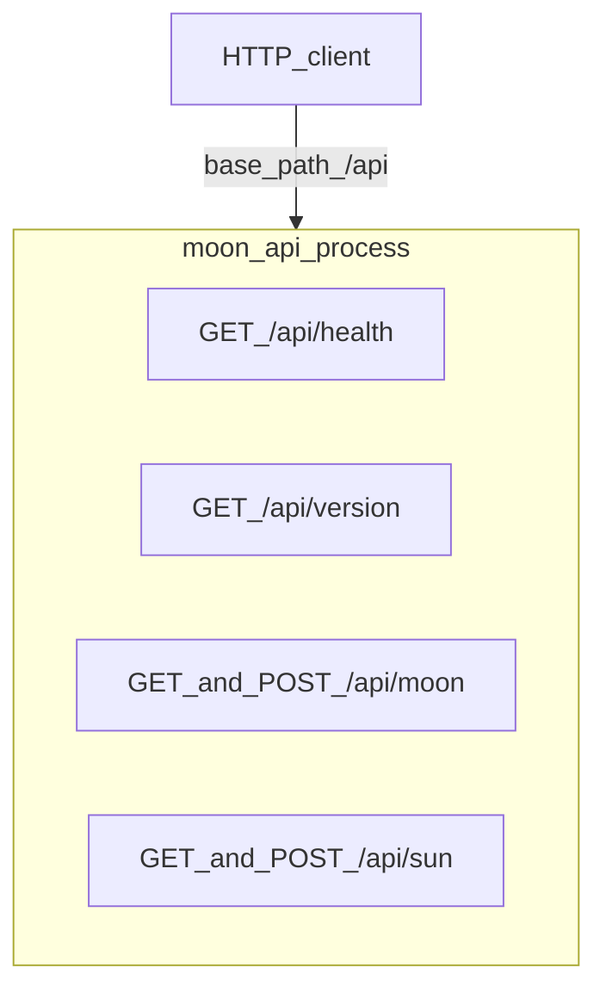
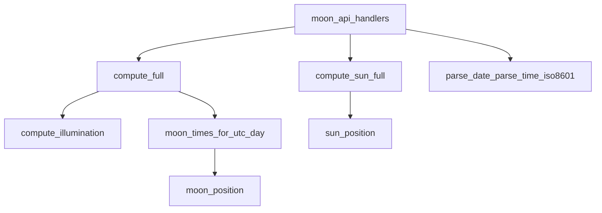
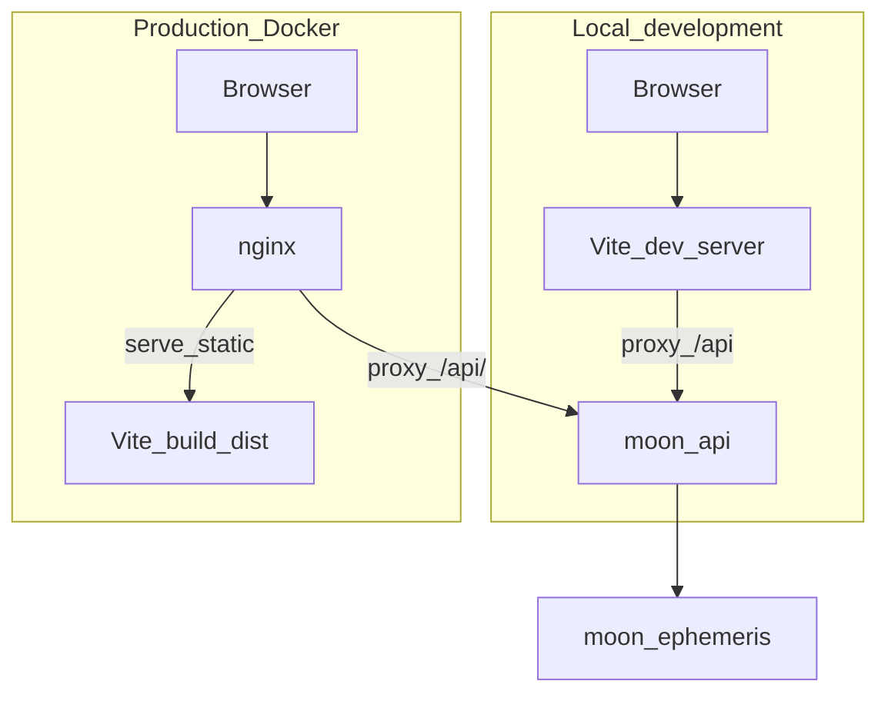

# Design

## Client (React + Vite)

The client is a single-page application under `src/frontend/`. It collects observation parameters, calls the backend JSON API over HTTP, and presents moon and sun results. Astronomy is **not** computed in the browser; the UI only formats API responses and maps UTC instants to a **local civil time** string when a timezone can be resolved from the coordinates.

### Feature outline

- **Observation form** — Latitude, longitude, calendar date, and UTC time used for both moon and sun requests.
- **Parallel API requests** — On submit, the client requests moon and sun data together and shows errors if either call fails.
- **Moon results** — Phase name (with illumination-aware override near full—see below), cycle metrics, illumination, a **moon phase disk** illustration (`MoonPhase.tsx`), moonrise/moonset (with local and UTC labeling where applicable).
- **Sun results** — Sun azimuth and altitude at the selected instant, with local and UTC labeling where applicable.
- **Timezone-aware display** — Resolves an IANA timezone from lat/lon and formats selected instants and rise/set strings for readability.
- **API version** — On load, fetches `/api/version` and shows the service name and version when available.
- **Direct API access** — Builds copyable absolute URLs for `GET /api/moon`, `GET /api/sun`, and `GET /api/version`, plus example `curl` commands.
- **Raw JSON** — Optional pretty-printed view of the last moon and sun JSON responses for debugging or integration.
- **Form validation and UX** — Basic numeric checks, loading state, disabled submit when inputs are incomplete, clipboard feedback for copy actions.

### Client feature definitions

| Feature | Definition |
|--------|------------|
| Observation form | User inputs **latitude** and **longitude** (decimal degrees), a **date** (`YYYY-MM-DD`), and **UTC time** (`HH:MM`). Submitting runs the computation for that single observation instant. |
| Parallel API requests | The UI issues **two** `GET` requests (`/api/moon` and `/api/sun`) with the same parameters **in parallel** (`Promise.all`) so results stay consistent for one submit. |
| Moon results | Renders the moon JSON: **phase** (name and cycle-related fields—see **Moon phase illustration** for label override rules), **illumination** (fraction/percent at the instant), **visibility** (moonrise/moonset in normal cases, or polar `always_up` / `always_down`), and the SVG **phase disk** beside the phase heading. |
| Sun results | Renders the sun JSON: **position** (**azimuth** and **altitude** in degrees at the requested UTC instant). The client does not compute ephemeris; values come from the API. |
| Timezone-aware display | Uses **tz-lookup** on `(lat, lon)` to pick an **IANA timezone**, then **Intl.DateTimeFormat** to show API UTC instants as **local date/time strings** (and still shows UTC where noted). If lookup fails, the UI falls back to UTC-only wording. |
| API version | Calls **`GET /api/version`** once on startup and displays **`service`** and **`version`** when the request succeeds; failures are ignored silently (no banner). |
| Direct API access | Derives **same-origin** URLs with the current form query string so users or scripts can hit the API **outside** the form (browser address bar, `curl`, HTTP clients). Includes copy-to-clipboard and a collapsible **curl** snippet block. |
| Raw JSON | Optional checkbox reveals **pretty-printed** `JSON.stringify` of the last successful moon and sun responses (mirrors what `GET` returned). |
| Form validation and UX | Requires non-empty lat/lon/date before submit; validates lat/lon parse as finite numbers on submit; shows **loading** state during requests and **error** messages from failed network or HTTP error bodies; copy buttons show brief **Copied** / error feedback. |

### Moon phase illustration

The disk beside **Phase** is rendered by **`src/frontend/src/MoonPhase.tsx`** with styling from **`moon-disk-bg`** and **`moon-lit-face`** in [`src/frontend/src/App.css`](src/frontend/src/App.css). Astronomy remains server-side; the graphic uses **`illumination.fraction`**, **`illumination.percent`** (optional but passed from `App.tsx`), and **`phase.cycle_fraction`** only for waxing vs waning—not for terminator curvature.

| Topic | Behavior |
|--------|----------|
| **Layers** | A **dark** full circle (disk “background”), then a **light** filled path for the sunlit portion. That matches the teaching convention: new moon is almost entirely dark; gibbous phases are mostly light; full moon is entirely light (within the thresholds below). |
| **Terminator shape** | Simplified **orthographic** model: terminator cross-section is an ellipse with vertical semi-axis \(r\) and horizontal semi-axis \(r \cdot \|2k - 1\|\), where \(k\) is **`illumination.fraction`** \((1 + \cos(\mathrm{inc}))/2\) from the API). That matches \(\|\cos(\mathrm{inc})\|\); **do not** infer terminator width from **`cycle_fraction`** alone—the backend **`phase`** wheel uses SunCalc-style mapping that is **not** linear in elongation, which previously skewed the limb when paired with \(\cos(2\pi \cdot \mathrm{cycle\_fraction})\). |
| **Waxing vs waning** | **`cycle_fraction` below 0.5** → waxing limb geometry (lit limb grows from the **right** in this SVG). **`cycle_fraction` at or above 0.5** → same path mirrored horizontally **`scale(-1, 1)`** about the disk center (single waxing construction avoids filling the complementary wedge that produced a thin crescent when the moon was almost full). |
| **Solid “snapshot” disks** | **New:** lit fraction strictly **below 1.0%** (`k < 0.01`) → dark disk only (no limb path). **Full:** lit **above 99.0%** → solid light disk over the dark layer; **`illuminationIndicatesFullMoon`** uses **`percent > 99`** when percent is present, else **`fraction > 0.99`**, so displayed percentages stay aligned with the rule even when floats differ slightly from rounding. |
| **Intermediate phases** | Crescent, quarter, and gibbous share the **same path generator**; only the endpoints snap to the solid new/full treatments above. Approximate bands documented in-code: new below 1%, crescent ~1–49%, quarter ~49–51%, gibbous ~51–99%, full above 99%. |
| **Phase label override** | **`phaseDisplayName`** in [`src/frontend/src/App.tsx`](src/frontend/src/App.tsx): when **`illuminationIndicatesFullMoon`** is true, the UI shows **“Full”** even if the API **phase name** is still an eighth-of-cycle label (e.g. **Waxing Gibbous**)—illumination near opposition can exceed the full threshold slightly before the cycle bucket flips. |

The helper **`illuminationIndicatesFullMoon`** is exported from `MoonPhase.tsx` for reuse by the label logic.

## HTTP API

All routes live under the **`/api`** prefix. Responses are **JSON** (`Content-Type: application/json`). Validation failures and many client errors return **400** with a body like `{"error":"..."}`. The server sets **CORS** headers for browser use; **`OPTIONS`** is implemented for the routes listed below so cross-origin or preflight clients can integrate.

### API surface (diagram)



### Endpoint summary

| Method(s) | Path | Purpose | Inputs |
|-----------|------|---------|--------|
| `GET` | `/api/health` | Liveness / simple status check | None |
| `GET` | `/api/version` | Service name and version string | None |
| `GET` | `/api/moon` | Moon phase, illumination, rise/set for the UTC day | **Query:** `lat`, `lon`, `date` (`YYYY-MM-DD`), optional `time` (`HH:MM` **UTC**, default `12:00`) |
| `POST` | `/api/moon` | Same semantics as `GET` | **JSON body:** `lat` (number), `lon` (number), `date` (string), optional `time` (string UTC) |
| `GET` | `/api/sun` | Sun **azimuth** and **altitude** at the instant | Same query params as `GET /api/moon` |
| `POST` | `/api/sun` | Same semantics as `GET` | Same JSON fields as `POST /api/moon` |
| `OPTIONS` | `/api/health`, `/api/version`, `/api/moon`, `/api/sun` | CORS preflight | Per browser `OPTIONS` request |

Moon responses include `instant_utc`, `location`, `phase`, `illumination`, and `visibility`. Sun responses include `instant_utc`, `location`, and `position` (`azimuth_deg`, `altitude_deg`). Full field-level examples are in [`README.md`](README.md).

### How to make requests

1. **Choose a base URL** for `moon-api` (the process that listens on a TCP port and serves `/api/...`):

   | Environment | Typical base | Notes |
   |-------------|--------------|--------|
   | API only (local) | `http://127.0.0.1:8080` | Run `./moon-api` or equivalent on port **8080** (or pass another port as the first argument). |
   | UI + API (local dev) | `http://127.0.0.1:5173` (same-origin) | Browser loads the app from **Vite**; `fetch('/api/...')` is proxied to **8080**—use the Vite origin, not 8080, from the browser. |
   | Docker Compose | `http://localhost:8080` (host mapped to container **80**) | **nginx** serves the SPA and proxies `/api/` to `moon-api` inside the container—use the **same host/port** as the web UI. |

2. **`GET` with query parameters** — Append `?key=value&...` for `lat`, `lon`, `date`, and optionally `time`. Values must be URL-encoded if needed.

3. **`POST` with JSON** — Send `Content-Type: application/json` and a body with `lat`, `lon`, `date`, and optionally `time`.

4. **Command-line examples** (replace the host/port if yours differs):

```bash
curl -s http://127.0.0.1:8080/api/health
curl -s http://127.0.0.1:8080/api/version
curl -s "http://127.0.0.1:8080/api/moon?lat=47.6062&lon=-122.3321&date=2026-04-05&time=12:00"
curl -s -X POST http://127.0.0.1:8080/api/moon \
  -H "Content-Type: application/json" \
  -d '{"lat":47.6062,"lon":-122.3321,"date":"2026-04-05","time":"12:00"}'
curl -s "http://127.0.0.1:8080/api/sun?lat=47.6062&lon=-122.3321&date=2026-04-05&time=12:00"
```

From a **browser** on the same origin as the app (Vite or nginx), relative URLs such as `/api/moon?...` work; from another machine or tool, use the full base URL of the server that forwards `/api` to `moon-api`.

## Computation layer

The **computation layer** is the C++ translation unit **`moon_ephemeris`** ([`src/backend/src/moon_ephemeris.h`](src/backend/src/moon_ephemeris.h), [`src/backend/src/moon_ephemeris.cpp`](src/backend/src/moon_ephemeris.cpp)). It lives in the **`moon` namespace**, has **no network or disk I/O**, and implements **low-precision, UI-grade** astronomy adapted from the **suncalc** family of algorithms (see source file attribution). The HTTP server (**`main.cpp`**) is the **only** caller in this project: it maps validated request parameters to these functions and serializes results as JSON.

### Computation structure (diagram)



`compute_full` combines illumination and phase naming with **moonrise/moonset** for the **UTC calendar day** of `date`. `moon_times_for_utc_day` searches hour steps and uses **moon position** above the horizon. `compute_sun_full` returns only **sun azimuth and altitude** at the requested UTC instant.

### Computation units (definitions)

| Unit | Definition |
|------|------------|
| **`compute_full`** | Top-level **moon** pipeline: given UTC **date/time** and **lat/lon**, builds a **`MoonResult`**: illumination + derived **phase name**, plus **`MoonTimes`** (rise/set JDs or polar flags) for that UTC day. |
| **`compute_illumination`** | From a **Julian date**, computes lunar **lit fraction**, **phase** \([0,1)\), orientation angle, and **Sun–Moon–Earth** angle (degrees) using the internal sun/moon direction model. |
| **`moon_times_for_utc_day`** | For a **UTC calendar day** and observer lat/lon, estimates **moonrise** and **moonset** (or **`always_up` / `always_down`**) using sampled **moon altitude** and a small horizon correction (same family of root-finding as the reference implementation). |
| **`moon_position`** | **Moon** azimuth, **altitude** (with atmospheric refraction), and **distance** (km) at a Julian date for a given observer—used internally for rise/set search (not serialized as its own object in the current JSON API). |
| **`compute_sun_full`** | Top-level **sun** pipeline: returns **`SunResult`** with **`sun_position`** only—**azimuth** and **altitude** in **degrees** at the requested UTC instant. |
| **`sun_position`** | **Sun** azimuth and altitude at a Julian date for the observer (refraction included in altitude; output in degrees in **`SunHorizon`**). |
| **Julian / time helpers** | **`julian_date_from_unix_seconds`** / **`unix_seconds_from_julian_date`** convert between JD and Unix time; used to connect calendar inputs to the internal JD timeline. |
| **Parsing and formatting** | **`parse_date`** / **`parse_time_hh_mm`** validate string inputs (also used from HTTP handlers). **`iso8601_utc_from_jd`** turns rise/set Julian dates into **UTC ISO-8601** strings for JSON. |

### How the computation layer is used

1. **Not callable over HTTP by itself** — Clients always call **`/api/...`**. The ephemeris has **no HTTP server** and **no public CLI** in this repo.
2. **Invocation path** — `moon-api` parses and validates inputs, then calls **`moon::compute_full`** for moon routes and **`moon::compute_sun_full`** for sun routes. Rise/set times are formatted with **`iso8601_utc_from_jd`** inside the JSON builders in [`main.cpp`](src/backend/src/main.cpp).
3. **Extending or testing** — Link against the same object file / library target as `moon-api` and call **`moon::`** functions from C++ tests or another binary; keep **determinism** (same inputs → same floats) in mind for regression checks.
4. **Semantics** — Phase and illumination depend on the **UTC instant**; rise/set depend on **location** and the **UTC day** boundary (see **Time and semantics** in [`README.md`](README.md)).

## System components and connections

The UI talks only to **`moon-api`** over HTTP (`/api/...`). The C++ server is the only component that calls **`moon_ephemeris`**; there is no direct link from the browser to the ephemeris code.

**Logical architecture** (always):


**How HTTP reaches `moon-api`** (pick the path that matches your environment; they are alternatives, not two live stacks at once):



In **development**, the browser loads the app from the Vite dev server and sends `/api` requests there; Vite forwards them to `moon-api` (typically on port 8080). In **production**, the browser talks to **nginx**, which serves the built static assets and reverse-proxies `/api/` to `moon-api` inside the container.
